# Interpol

**Interpol** is a Glyphs plugin for real-time variable font interpolation preview. It allows you to visualize and interact with interpolated glyph shapes, detect interpolation kinks, and fix them using automated tools.

>[!NOTE]
>This plugin was made in part using Github Copilot and a few different LLM models, mainly Anthropic's Claude 4.5 Sonnet and Opus.

This plugin owes a lot to:
- [Interpolate](https://github.com/simoncozens/Interpolate/) by [Simon Cozens](https://github.com/simoncozens)
- [Show Kinks](https://github.com/harbortype/ShowSmoothNodeAngleAndProportion) by [Harbor Type](https://github.com/harbortype)
- [Smooth-Operator](https://github.com/ryanbugden/Smooth-Operator) by [Ryan Bugden](https://github.com/ryanbugden)

## Features

- **Live Interpolation Preview** - See interpolated glyphs in real-time as you edit masters
- **Interactive Axis Control** - Adjust axis values with sliders or mouse drag
- **Kink Detection** - Automatically identify problematic interpolation nodes
- **Dekink Tool** - Fix interpolation kinks with automated ratio synchronization
- **Preview Window** - View multiple glyphs at once with live interpolation
- **Customizable Display** - Control what’s visible: fill, outline, nodes, handles, anchors, kinks

## Installation

1. Download the `Interpol.glyphsPlugin` package
2. Double-click to install, or manually copy to:
   - `~/Library/Application Support/Glyphs 3/Plugins/`
3. Restart Glyphs

## Getting Started

### Enabling the Preview

1. Open a variable font with at least 2 masters
2. Go to **View → Show Interpol** to enable the reporter
3. The palette panel will appear showing axis sliders and a few other controls

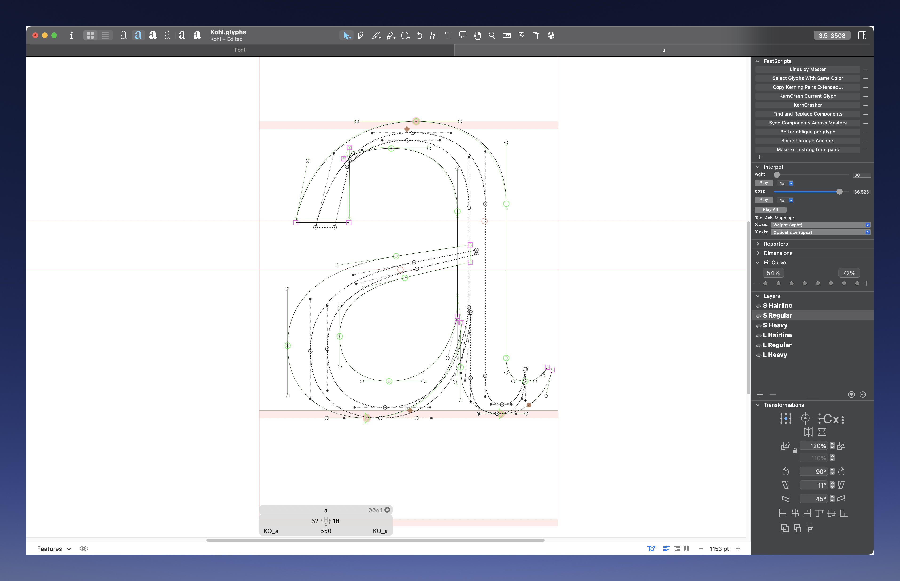

### The Palette Panel

The palette appears when Interpol is enabled and shows:

#### Axis Sliders
- Each axis in your font gets a slider
- Drag the slider to change the interpolation position
- Type exact values in the text field
- **Play button** (▶) - Animate the axis back and forth
- **Speed control** - Adjust animation speed (0.5x, 1x and 2x)

#### Axis Assignment (for Mouse Tool)
Two dropdown menus let you assign axes to mouse movements:
- **Horizontal Axis** - Controlled by left/right mouse drag
- **Vertical Axis** - Controlled by up/down mouse drag

### The Mouse Tool

The Interpol tool allows you to control axis values by dragging the mouse.

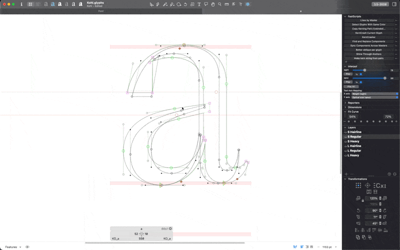

1. Select the Interpol tool from the toolbar (keyboard shortcut: **A** by default)
2. Click and drag in the canvas:
   - **Horizontal drag** controls the first assigned axis
   - **Vertical drag** controls the second assigned axis
3. The interpolated preview updates in real-time as you drag

**Note:** When the tool is active, normal selection and editing are disabled. Switch back to the Select tool (V) to edit.

### Display Options Menu

Right-click on the Edit View to access display options:

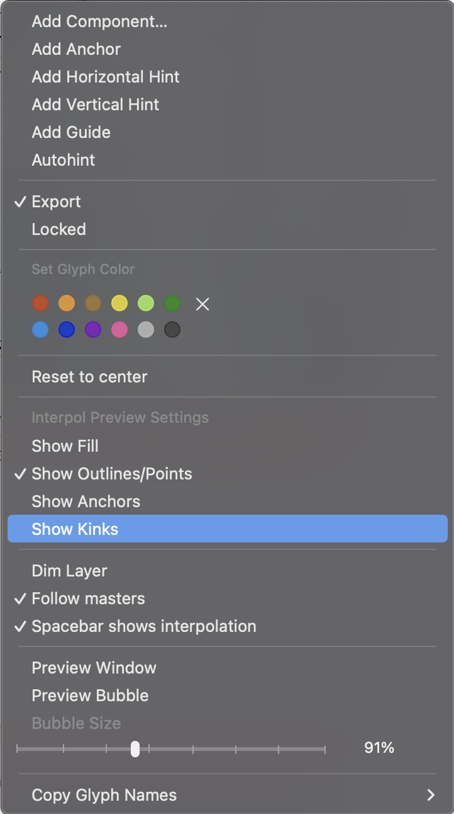

#### Preview Options
- **Show Fill** - Display filled interpolated glyphs
  
  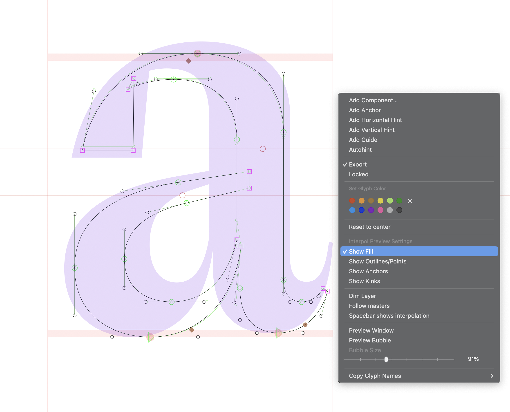
- **Show Outlines & Nodes** - Display on-curve and off-curve points for interpolated glyphs
  
  
- **Show Anchors** - Display anchor positions at interpolated locations
  
  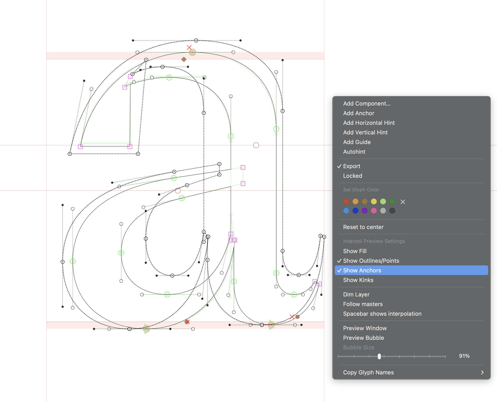
- **Show Kinks** - Highlight potential interpolation problems (see Kink Detection)
  
  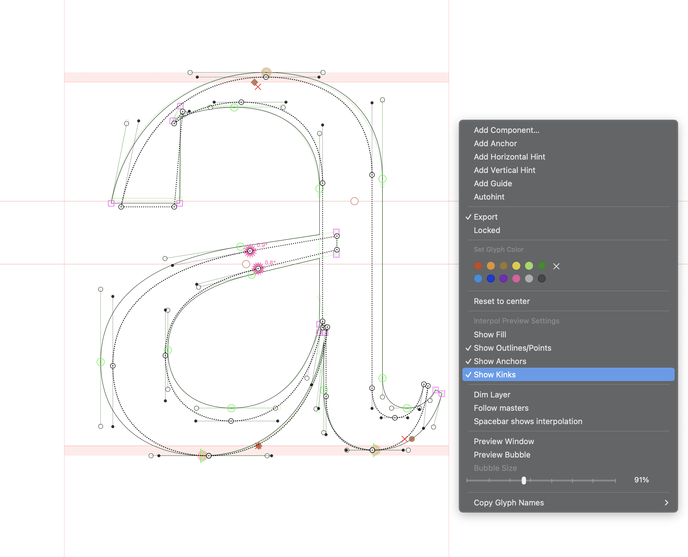

#### Master Tracking
- **Follow Masters** - The interpolation preview follows the current master’s location in the design space
  
  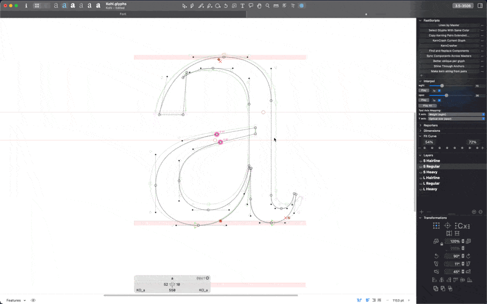

#### Layer Dimming
- **Dim Master Layer** - Reduce opacity of the underlying master layer to see the interpolation preview more clearly
  
  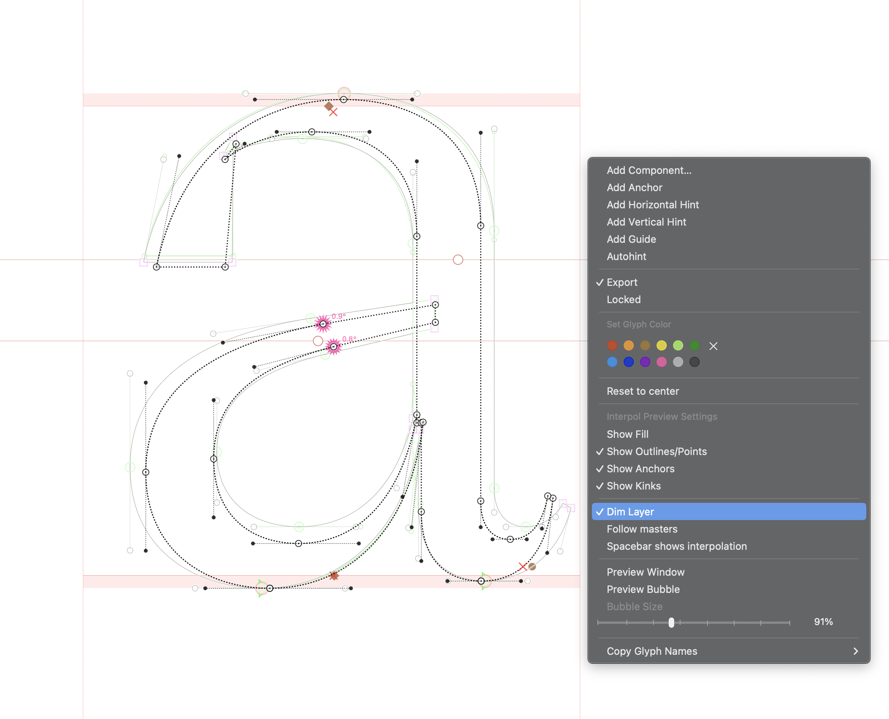

#### Preview Window & Bubble
- **Preview Window** - Open a floating window showing a filled interpolation preview of the current line in the Edit View
  
  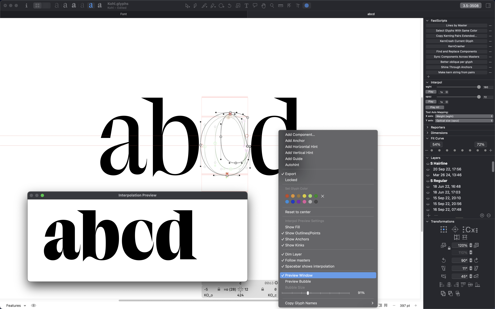
- **Preview Bubble** - Open an interpolation preview bubble which shows up under the current line in the Edit View
  
  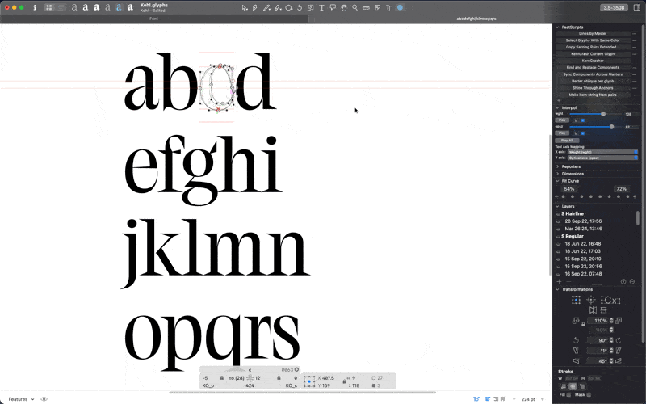
- **Bubble Size** - Adjust the size of the hover bubble (25% to 200%)

#### Space Preview
- **Spacebar Shows Interpolation** - When enabled, the usual spacebar preview from Glyphs will show the interpolation at the currently selected axis positions for the current line
  
  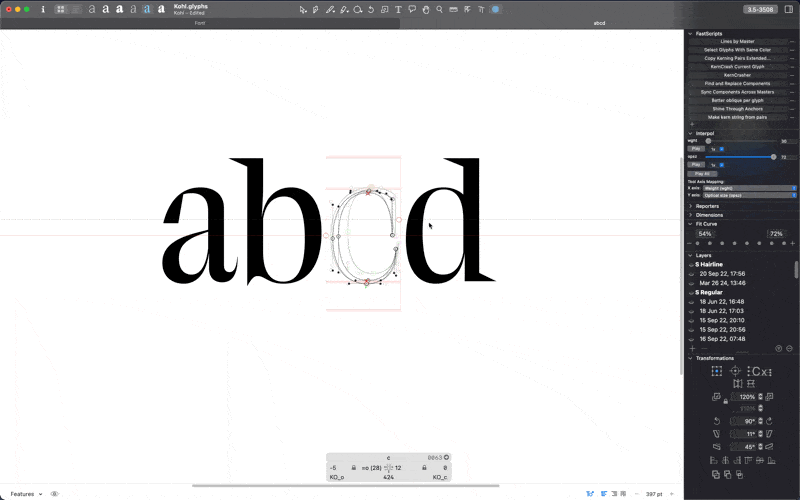

## Kink Detection

### Visualizing Kinks

When **Show Kinks** is enabled, Interpol marks problematic nodes:

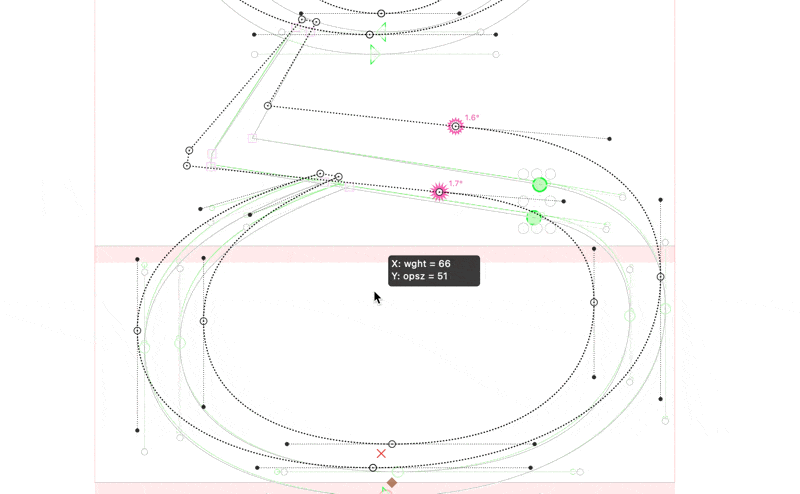

- **Pink indicators** - Appear around nodes with interpolation kinks
- **Severity-based sizing** - Larger, spiky indicators = more severe kinks
- **Real-time updates** - Indicators update as you adjust interpolation position
- **Kink angle** - It shows the angle by which the handle differs from its expected collinear path

Kink indicators only appear when the interpolation severity exceeds a threshold, so minor kinks are ignored.

## The Dekink Panel

The Dekink panel provides automated tools to fix interpolation kinks by synchronizing point ratios across masters.

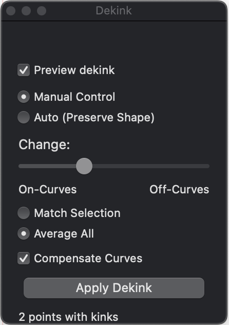

### Opening the Panel

1. Select one or more smooth on-curve points with kinks
2. Access the panel via right-click and select **Dekink Window…**

The panel is **non-modal** - you can keep it open while working in Glyphs.

### Panel Controls

#### Preview Dekink (checkbox)
- When **ON**: See a live preview of proposed changes (displayed in green by default)
- When **OFF**: No preview shown

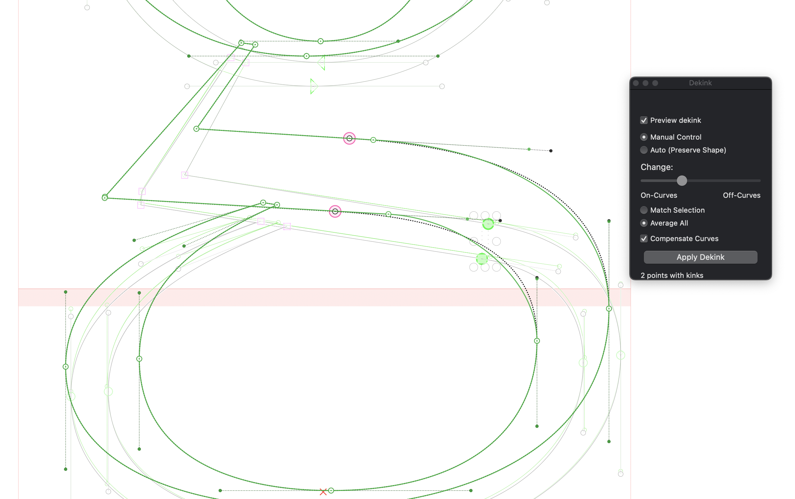

#### Mode Selection

**Manual Control Mode:**
Gives you full control over how the dekinking process works.

- **Change slider** - Balance between moving on-curve points vs off-curve handles
  - **Left (On-Curves)** - Primarily moves the on-curve point, keeps handles relatively fixed
  - **Right (Off-Curves)** - Primarily adjusts handles, keeps on-curve point relatively fixed
  - **Middle** - Balanced approach (default: 15% from left)

- **Match Selection** (radio button) - Makes the ratios for all other master follow the ratios in the currently selected master
- **Average All** (radio button) - Calculates the average ratio across all masters and applies it everywhere

- **Compensate Curves** (checkbox) - When enabled, attempts to preserve the original curve shape by adjusting handle positions and lengths proportionally

**Auto (Preserve Shape) Mode:**
Automatically finds the best balance between dekinking and preserving the original curve shapes. This mode:
- Analyzes curve shapes using bezier math
- Calculates optimal adjustments to minimize both kinks and shape distortion
- Works well for most cases without manual tuning
- Uses a maximum deviation threshold (25 units) to prevent excessive changes

#### Selection Counter
Shows how many smooth points are selected and how many have kinks:
- “X points with kinks” - All selected points have kinks
- “X of Y with kinks” - Some selected points have kinks
- “0 with kinks” - None of the selected points need adjustment

**Note:** The panel automatically filters your selection to only operate on points that actually have kinks.

#### Apply Dekink Button
Applies the dekinking to all masters. This operation:
- Modifies point positions across all masters
- Can be undone with Edit → Undo (⌘Z)
- Triggers automatic kink re-detection

### Dekink Workflow

1. **Enable kink visualization**: Turn on **Show Kinks** in the display menu
2. **Select problematic nodes**: Click nodes marked with pink indicators
3. **Open Dekink panel**: Right-click on the edit view and select **Dekink Window…**
4. **Choose mode**:
   - Try **Auto mode** first for automatic optimization
   - Use **Manual mode** if you need specific control
5. **Preview**: Enable “Preview Dekink” to see changes in green
6. **Adjust** (Manual mode only): 
   - Move the Change slider to balance on-curve vs off-curve movement
   - Toggle Compensate Curves if shape preservation is important
7. **Apply**: Click “Apply Dekink” to commit changes
8. **Verify**: Check that kink indicators disappear or become smaller

## Settings

Access settings via **Window → Interpol Settings...**

### Available Settings

#### Tool Keyboard Shortcut
- Default: **A**
- Change to any single letter key
- Controls which key activates the Interpol mouse tool

#### Preview Fill Color
- Default: Purple (0.38, 0.0, 0.88, 0.15)
- Color of the filled interpolated shapes

#### Preview Outline/Nodes/Handles Color
- Default: Black (0.0, 0.0, 0.0, 0.8)
- Color for outline stroke, nodes, and handle lines

#### Kink Indicator Color
- Default: Pink (1.0, 0.0, 0.6, 1.0)
- Color of the diamond indicators marking kinks

#### Dekink Window Preview Color
- Default: Green (0.0, 0.7, 0.2, 1.0)
- Color shown when previewing dekink changes

#### Line Style
- **Dotted lines** (default) - Outline uses dotted stroke
- **Solid lines** - Outline uses solid stroke

### Resetting to Defaults
Click **”Reset to Defaults”** to restore all original settings.

---

**Version:** 3.0  
**Author:** José Solé @ Dogray Type Foundry
**License:** MIT
